# Contract Monitoring System - Activity Diagram

## System Overview

The PFDA Contract Monitoring system is a Laravel + Next.js application for managing rental contracts, payments, and tenant relationships. Below is the comprehensive activity flow:

```mermaid
graph TD
    Start([User Visits App]) --> Auth{Authenticated?}
    
    Auth -->|No| Login[User Logs In]
    Login --> Register{User Exists?}
    Register -->|No| SignUp[Register New Account]
    SignUp --> DB1[(Save User)]
    Register -->|Yes| Auth2[Authenticate via Sanctum]
    Auth2 --> DB2[(Store Token)]
    
    Auth -->|Yes| Dashboard[Dashboard Loaded]
    DB1 --> Dashboard
    DB2 --> Dashboard
    
    Dashboard --> UserRole{User Role?}
    
    UserRole -->|Admin/Staff| AdminDash[Admin Dashboard]
    UserRole -->|Cashier| CashierDash[Cashier Dashboard]
    UserRole -->|Tenant| TenantDash[Tenant Portal]
    
    %% ADMIN/STAFF FLOW
    AdminDash --> AdminChoose{Admin Action?}
    
    AdminChoose -->|Create Contract| Contract1[Create New Contract]
    Contract1 --> SelectTenant[Select Tenant]
    SelectTenant --> SelectSpace[Select Rental Space]
    SelectSpace --> ContractForm[Fill Contract Details]
    ContractForm --> CreateDB[(Contract Created)]
    CreateDB --> ActivateOpt{Activate Now?}
    ActivateOpt -->|Yes| Activate[Activate Contract]
    Activate --> GenSchedule[Generate Payment Schedule]
    GenSchedule --> PaymentDB[(Payment Records Created)]
    PaymentDB --> Notify1[Create Activation Notification]
    Notify1 --> AdminDash
    
    AdminChoose -->|View Contracts| ViewContracts[List All Contracts]
    ViewContracts --> Filter{Filter/Search?}
    Filter -->|Status| FilterStatus[By Status]
    FilterStatus --> DisplayContracts[Display Contracts]
    DisplayContracts --> AdminDash
    Filter -->|Search| SearchContracts[By Tenant/Number]
    SearchContracts --> DisplayContracts
    
    AdminChoose -->|Manage Tenants| ManageTenants[View Tenant List]
    ManageTenants --> TenantOpt{Action?}
    TenantOpt -->|Create| NewTenant[Add New Tenant]
    NewTenant --> TenantForm[Fill Tenant Info]
    TenantForm --> TenantDB[(Tenant Saved)]
    TenantDB --> AdminDash
    TenantOpt -->|View| TenantDetail[View Tenant Details]
    TenantDetail --> AdminDash
    
    AdminChoose -->|View Payments| PaymentList[View Payment List]
    PaymentList --> PaymentFilter{Filter?}
    PaymentFilter -->|By Status| StatusPayment[Pending/Overdue/Paid]
    StatusPayment --> PaymentDisplay[Display Payments]
    PaymentDisplay --> AdminDash
    
    AdminChoose -->|View Reports| Reports[Reports Dashboard]
    Reports --> ReportType{Report Type?}
    ReportType -->|Contracts| ContractRep[Contract Report]
    ReportType -->|Payments| PaymentRep[Payment Report]
    ReportType -->|Delinquency| DelinqRep[Delinquency Report]
    ReportType -->|Revenue| RevenueRep[Revenue Report]
    ReportType -->|Audit Log| AuditRep[Audit Log Report]
    ContractRep --> AdminDash
    PaymentRep --> AdminDash
    DelinqRep --> AdminDash
    RevenueRep --> AdminDash
    AuditRep --> AdminDash
    
    %% CASHIER FLOW
    CashierDash --> CashierChoose{Cashier Action?}
    
    CashierChoose -->|Record Payment| RecordPay[View Collectibles]
    RecordPay --> SelectPayment[Select Payment to Record]
    SelectPayment --> PaymentDetail[View Payment Details]
    PaymentDetail --> EnterAmount[Enter Payment Amount]
    EnterAmount --> SelectMethod[Select Payment Method]
    SelectMethod --> EnterRef[Enter Reference Number]
    EnterRef --> RecordPayDB[(Update Payment Record)]
    RecordPayDB --> UpdateBalance[Calculate Balance]
    UpdateBalance --> CheckBalance{Balance = 0?}
    CheckBalance -->|Yes| MarkPaid[Mark as Paid]
    CheckBalance -->|No| MarkPartial[Mark as Partial]
    MarkPaid --> Receipt[Generate Receipt]
    MarkPartial --> Receipt
    Receipt --> CashierDash
    
    CashierChoose -->|View Today Collection| Todays[Today's Collection Summary]
    Todays --> CashierDash
    
    CashierChoose -->|View Demand Letters| DemandList[View Demand Letters]
    DemandList --> DemandFilter{Filter?}
    DemandFilter -->|By Contract| ContractDemand[Show for Contract]
    DemandFilter -->|All| AllDemand[Show All]
    ContractDemand --> CashierDash
    AllDemand --> CashierDash
    
    %% BACKGROUND PROCESSES
    AdminDash -.->|Scheduled| CheckExpiry[Check Expiring Contracts]
    CheckExpiry -->|30 Days| SendNotif1[Send Expiry Notification]
    SendNotif1 --> NotifDB[(Log Notification)]
    
    AdminDash -.->|Scheduled| CheckRenewal[Check Contracts for Renewal]
    CheckRenewal -->|2 Months| SendNotif2[Send Renewal Notification]
    SendNotif2 --> NotifDB
    
    AdminDash -.->|Scheduled| CheckOverdue[Check Overdue Payments]
    CheckOverdue --> CalcInterest[Calculate Interest]
    CalcInterest --> ApplyInterest[Apply Interest Charges]
    ApplyInterest --> UpdatePayment[(Update Payment)]
    UpdatePayment --> GenDemand[Generate Demand Letter]
    GenDemand --> DemandDB[(Demand Letter Created)]
    
    %% TENANT/PUBLIC FLOW
    TenantDash --> TenantChoose{Tenant Action?}
    TenantChoose -->|Scan QR| ScanQR[Scan Contract QR Code]
    ScanQR --> QRValidate{QR Valid?}
    QRValidate -->|Yes| ViewQRContract[View Contract Details]
    QRValidate -->|No| QRError[Show Error]
    ViewQRContract --> TenantDash
    QRError --> TenantDash
    
    TenantChoose -->|View Contracts| ViewMyContracts[My Contracts]
    ViewMyContracts --> TenantDash
    
    TenantChoose -->|Check Payments| ViewMyPayments[My Payments]
    ViewMyPayments --> TenantDash
    
    TenantChoose -->|Download Lease| DownloadLease[Download Contract File]
    DownloadLease --> FileServe[Serve PDF/Document]
    FileServe --> TenantDash
    
    style Start fill:#e1f5ff
    style Auth fill:#f3e5f5
    style AdminDash fill:#e8f5e9
    style CashierDash fill:#fff3e0
    style TenantDash fill:#fce4ec
    style End fill:#e1f5ff
```



## Core Workflows

### 1. **User Authentication Flow**
- User registers or logs in
- Credentials validated against database
- Laravel Sanctum token generated
- Token stored for authenticated requests

### 2. **Contract Management Flow** (Admin/Staff)
- Create contract by selecting tenant and rental space
- Fill contract details (dates, amount, terms)
- Optional: Activate contract immediately
- Payment schedule auto-generated based on contract duration
- Activation notification sent to admin/staff/cashier users

### 3. **Payment Processing Flow** (Cashier)
- View collectible payments
- Select payment to record
- Enter payment amount and method
- System calculates remaining balance
- If balance = 0, mark as "paid"; otherwise "partial"
- Generate receipt for tenant
- Automatic interest calculation for overdue payments

### 4. **Contract Renewal Flow** (Automated)
- Scheduled task checks contracts 2 months before expiry
- Creates renewal notification for admin/staff
- Admin can create new contract or renew existing

### 5. **Overdue Management Flow** (Automated)
- Scheduled task identifies overdue payments
- Calculates accumulated interest based on interest rate
- Updates payment status to "overdue"
- Generates demand letter for tenant
- Creates notification for admin

### 6. **Tenant Portal Flow** (Public/Tenant)
- Scan QR code to view contract details
- View assigned contracts
- View payment history and due dates
- Download lease agreement

## Key Components

| Component | Role | Permissions |
|-----------|------|-------------|
| **Admin/Staff** | System administrators | Full access to all features |
| **Cashier** | Payment recording | View/record payments, view demand letters |
| **Tenant** | Contract holder | View own contracts, payments, download lease |

## Database Relationships

```
User (1) ─── (Many) Tenant
Tenant (1) ─── (Many) Contract
Contract (1) ─── (Many) Payment
Contract (1) ─── (Many) DemandLetter
Payment (1) ─── (Many) DemandLetter
Contract (1) ─── (1) RentalSpace
Tenant (1) ─── (Many) ChatMessage
User (1) ─── (Many) Notification
```

## API Endpoints Summary

**Authentication:**
- POST `/register` - Register new user
- POST `/login` - User login
- POST `/logout` - User logout
- GET `/me` - Get current user info

**Contracts:**
- GET `/contracts` - List contracts
- POST `/contracts` - Create contract
- POST `/contracts/{id}/activate` - Activate contract
- POST `/contracts/{id}/renew` - Renew contract
- POST `/contracts/{id}/terminate` - Terminate contract

**Payments:**
- GET `/payments` - List payments
- POST `/payments` - Create payment
- POST `/payments/{id}/record` - Record payment
- GET `/demand-letters` - List demand letters

**Reports:**
- GET `/reports/dashboard-stats` - Dashboard statistics
- GET `/reports/contracts` - Contract report
- GET `/reports/payments` - Payment report
- GET `/reports/delinquency` - Delinquency report

**Tenants:**
- GET `/tenants` - List tenants
- POST `/tenants` - Create tenant
- GET `/tenants/{id}/qr-code` - Get tenant QR code

